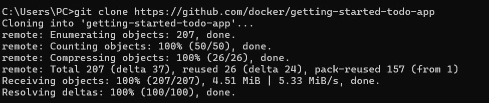
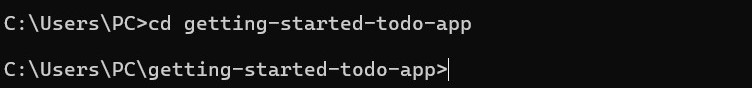
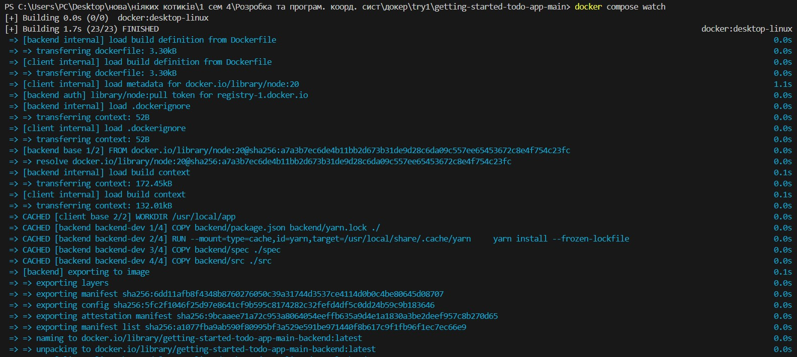

# Docker (готово до перевірки)
"Вивчення Docker"

Мета: Опанувати базові налаштування та використання Docker, пройшовши курс на Docker Documentation.

git clone - команда для клонування репозиторію

cd - команда для переходу у директорію створенного репозиторію

docker compose watch - команда для запуску проєкту

