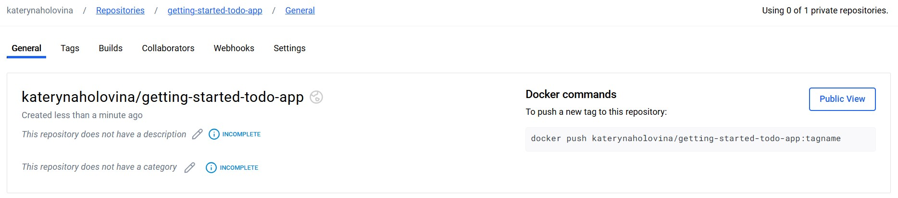

# Docker (готово до перевірки)
"Вивчення Docker"

Мета: Опанувати базові налаштування та використання Docker, пройшовши курс на Docker Documentation.

git clone - команда для клонування репозиторію

cd - команда для переходу у директорію створенного репозиторію

docker compose watch - команда для запуску проєкту

Відкриваємо у браузері додаток:

Змінюємо вміст коду (привітання):

Перевіряємо зміни:

Змінюємо вміст коду (Form):

Перевіряємо зміни:

Змінюємо вміст коду (background color):

Перевіряємо зміни:

Створюємо репозиторій в Docker Hub:

Надсилаємо image в репозиторій:

Результат:

